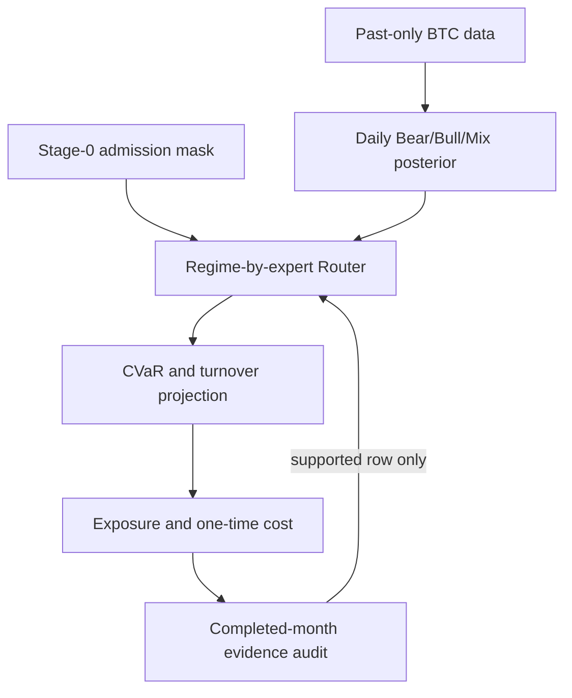

# Evidence-Weighted Router Architecture

## Router equation

The daily expert weights are the posterior-weighted trust rows after applying the immutable admission mask. Rejected experts have exact zero stored trust and exact zero portfolio weight.

## Trust repair

The previous global-tail-then-condition calculation is removed. Each regime obtains its own posterior-weighted loss distribution. Trust changes only when that regime has enough mass and effective observations to support the 95% tail estimate. Unsupported rows are carried forward unchanged.

## Causal clock

- information and Router posterior: `d-1`;
- portfolio decision: `d`;
- realized portfolio return: `d+1`;
- risk scenarios: returns completed no later than `d`;
- trust update: after the return month is complete.

Only Cash and Buy-and-Hold are currently admitted. Trend, volatility, drawdown and ATP remain structurally present but receive zero weight.
